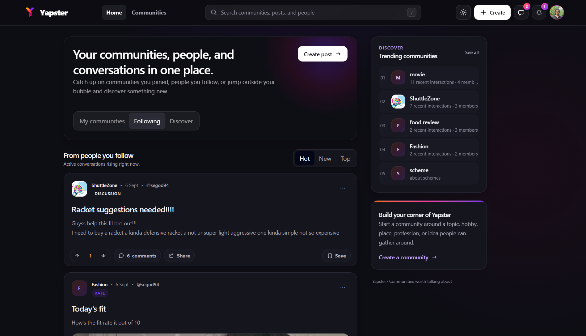
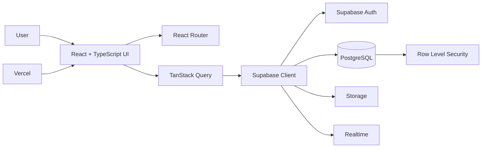

<div align="center">
  

  <p><strong>A modern, community-first social platform for discovery, conversation, and meaningful participation.</strong></p>

  <p>
    <a href="https://yapster-social.vercel.app/"><strong>Live App</strong></a>
    ·
    <a href="#features">Features</a>
    ·
    <a href="#architecture">Architecture</a>
    ·
    <a href="#local-development">Local Setup</a>
  </p>

  <p>
    <a href="https://yapster-social.vercel.app/"></a>
    
    
    
  </p>
</div>

---

## Product preview

<div align="center">
  <a href="https://yapster-social.vercel.app/">
    
  </a>
  <sub>Current desktop home experience · <a href="https://yapster-social.vercel.app/">Open the live application</a></sub>
</div>

## About Yapster

**Yapster** is a full-featured social platform centered on communities rather than a single global feed. Users can discover interest-based spaces, follow people, publish rich posts, join threaded discussions, message other users, and participate in moderated community ecosystems.

The project is designed as a production-style application rather than a basic social-media demo: community ownership and moderator roles are separate, feeds support multiple discovery modes, conversations are threaded, messaging is realtime, and backend access is protected with Supabase Row Level Security.

> **Tagline:** Communities worth talking about.

## Features

| Area | Capabilities |
| --- | --- |
| **Communities** | Create and join communities, categories, icons, banners, public rules, post flairs, owner/moderator roles, member lists |
| **Publishing** | Text, image, link, and poll posts with community-aware creation flows |
| **Feeds & discovery** | Hot, New, Top, Following, joined-community, and discovery-oriented experiences |
| **Engagement** | Post voting, comment voting, saved posts, sharing, threaded replies, mentions, YapScore reputation |
| **Profiles & social graph** | Public profiles, follow/unfollow, follower and following relationships, blocking, public activity |
| **Notifications** | Unread state, deep-linked post/comment destinations, mentions, replies, and social activity |
| **Messaging** | One-to-one realtime conversations, reactions, replies, read receipts, and message controls |
| **Moderation** | Reports, moderation queues/history, member controls, mute/ban actions, dedicated management interfaces |
| **Experience** | Responsive desktop/mobile layouts, dark and light themes, polished navigation and community UI |

## Product principles

Yapster is built around a few deliberate product choices:

- **Community-first discovery** — interest-based spaces are first-class entities, not just hashtags or filters.
- **People + communities** — users can follow individuals while also participating in topic-driven spaces.
- **Trust and moderation** — owners and moderators have explicit roles and dedicated management workflows.
- **Conversation depth** — threaded comments, replies, mentions, notifications, and messaging support ongoing discussion.
- **Responsive by default** — desktop and mobile experiences share the same product model without reducing core functionality.

## Tech stack

| Layer | Technology |
| --- | --- |
| Frontend | React 18, TypeScript |
| Routing | React Router 7 |
| Data fetching / cache | TanStack Query 5 |
| Styling | Tailwind CSS 4 |
| Build tooling | Vite 5 |
| Backend | Supabase |
| Database | PostgreSQL via Supabase |
| Authentication | Supabase Auth |
| File storage | Supabase Storage |
| Realtime | Supabase Realtime |
| Authorization | Supabase Row Level Security |
| Hosting | Vercel |

## Architecture



### Frontend responsibilities

- Route-level pages live under `src/pages/`.
- Reusable product UI and interaction logic live under `src/components/`.
- Authentication state is centralized in `src/context/`.
- Shared helpers and domain utilities live under `src/lib/`.
- TanStack Query handles server state, cache invalidation, loading, and mutation flows.

### Backend responsibilities

- Supabase Auth handles sessions and identity.
- PostgreSQL stores users, communities, posts, comments, relationships, reports, and messages.
- Storage handles user/community/post media.
- Realtime powers live messaging behavior.
- Database policies enforce access rules through Row Level Security.

## Local development

### Requirements

- Node.js
- npm
- A Supabase project

### 1. Clone the repository

```bash
git clone https://github.com/abhishekldev07/Yapster.git
cd Yapster
```

### 2. Install dependencies

```bash
npm install
```

### 3. Configure environment variables

Copy the example file:

```bash
cp .env.example .env
```

Then provide your Supabase project values:

```env
VITE_SUPABASE_URL=https://your-project.supabase.co
VITE_SUPABASE_ANON_KEY=your-anon-or-publishable-key
```

### 4. Start the development server

```bash
npm run dev
```

Vite will print the local development URL in your terminal.

## Available scripts

| Command | Purpose |
| --- | --- |
| `npm run dev` | Start the Vite development server |
| `npm run build` | Type-check and create a production build |
| `npm run lint` | Run ESLint with zero-warning enforcement |
| `npm run preview` | Preview the production build locally |

## Project structure

```text
Yapster/
├── public/                 # Static brand assets
├── src/
│   ├── components/         # Shared UI and product components
│   ├── context/            # Authentication/session state
│   ├── lib/                # Shared helpers and domain logic
│   └── pages/              # Route-level screens
├── supabase/
│   └── migrations/         # Database schema, policies, and feature migrations
├── docs/
│   └── assets/             # README and project presentation assets
├── .env.example
├── package.json
├── vercel.json
└── README.md
```

## Security and permissions

Yapster separates client-side presentation from backend authorization. Sensitive operations are not intended to rely only on hidden buttons or route visibility.

Key controls include:

- authenticated Supabase sessions
- database-level Row Level Security policies
- community owner and moderator role checks
- scoped moderation actions
- community membership and ban state enforcement
- environment-based Supabase configuration

When extending the platform, permission changes should be implemented in the database policy layer as well as the UI.

## Deployment

The production frontend is deployed on **Vercel** and connects to **Supabase** for backend services.

**Production:** https://yapster-social.vercel.app/

For a new deployment:

1. Connect the repository to Vercel.
2. Configure `VITE_SUPABASE_URL` and `VITE_SUPABASE_ANON_KEY` in the deployment environment.
3. Ensure the corresponding Supabase migrations and policies are applied.
4. Deploy from the desired Git branch.

## Current direction

Yapster already covers the core surface area of a modern community social product. Future iterations can continue improving recommendation quality, richer media experiences, notification intelligence, moderation analytics, and mobile polish without changing the platform's community-first foundation.

---

<div align="center">
  <strong>Yapster</strong><br/>
  <sub>Communities worth talking about.</sub><br/><br/>
  <a href="https://yapster-social.vercel.app/">Launch Yapster →</a>
</div>
